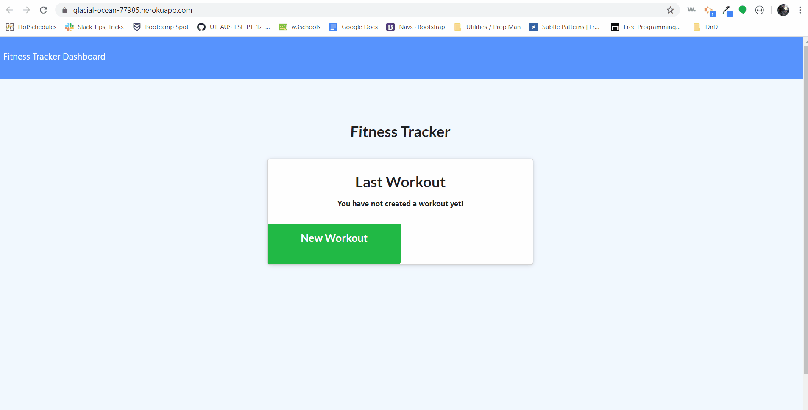

  # Workout Tracker

Github Code: https://github.com/kkwoka/WorkoutTracker

Heroku Website: https://glacial-ocean-77985.herokuapp.com/


  ## Description
  ​
  This is an app for a user that wants to track their daily workouts. The user may add resistance and cardio workouts for their current day. The user may also update a previous workout for that day.
  ​
  ## Table of Contents 
  * [GIF](#GIF)

  * [Installation](#installation)
  ​
  * [Usage](#usage)
  ​
  * [License](#license)
  ​
  * [Contributing](#contributing)
  ​
  * [Tests](#tests)
  ​
  * [Questions](#questions)
  ​
  ## GIF
  

  ## Installation
  ​
  To install necessary dependencies, run the following command:
  ```
  npm i
  ```
  ## Usage
  ​
  node.js, mongodb/mongoose
    
  ## Contributing
  ​
  mongodb
  ​
  ## Tests
  ​
  To run tests, run the following command:
  ```
  node server.js
  ```
 
  ## Questions
  ​
  
  ​
  If you have any questions about the repo, contact [kkwoka](https://github.com/kkwoka).